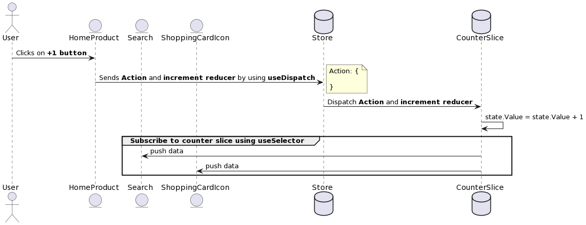

# Redux Toolkit Sequence Diagram

**This is a very simple example that demonstrates how redux works in React, HomeProduct component is publisher, the other two components are subscribers**

**HomeProduct component wants to communicate with two other components, we have different solutions like communication using properties, react context, and redux.**

